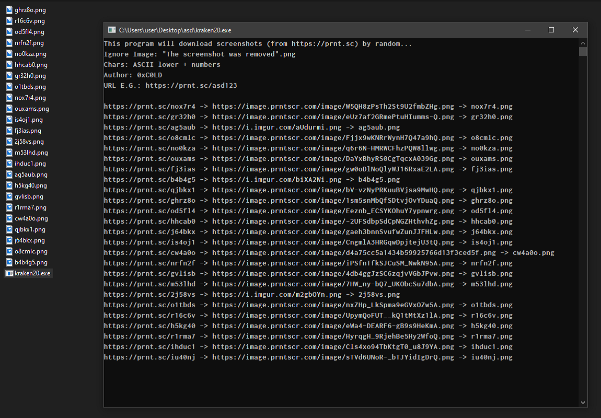

# kraken20
download random screenshots from prnt.sc / prnt.sc image fuzzer (C#, console)

## How it works:
prnt.sc's URLs contain 6 characters (ASCII lowercase & numbers... e.g. https://prnt.sc/qwe123)  
So we can easily fuzz & download them  
If the downloaded image is the "The screenshot was removed" image it will be disposed rather then saved to the disk... 

## DOWNLOAD
\[[here](https://github.com/0xC0LD/kraken20/raw/master/kraken20/kraken20/bin/Release/kraken20.exe)\]
